<h1 style='color:#9FE1B4; font-family: serif;'>Moodify: the app that matches a song to your mood</h1> 

    
<h2 style='color:#9FE1B4; font-family: serif;'>About this project</h2> 
Moodify is an application that leverages facial recognition technology to personalize music recommendations on Spotify.    By analysing the user's facial expressions in real-time using the device's camera, Moodify can infer the user's current mood and suggest songs that match their emotional state. This project explores the opportunity we have to harness the power of computer vision to create more meaningful and personalized interactions with technology.\n My aim was to tackle a more the human aspect of data analytics by going beyond the quantitative analysis of data and incorporating the qualitative aspects of human experience, such as perception, cognition and emotion. Computer vision, enables machines to interpret visual data in ways that resembles human perception, such as recognizing objects, scenes and facial expressions.   By incorporating these human aspects into data analytics we can gain deeper insights into complex phenomena such as social interactions cultural norms and psychological states, that are not easily captured by numerical data alone.

But how can we teach a computer to recognize emotions?
 

<h2 style='color:#9FE1B4; font-family: serif;'>The CNN Model</h2>

<h3 style='color:#9FE1B4;'>Deep learning model for image classification</h3>

"A machine needs data to learn. Lots of it. Data is the most important part of any machine learning / deep learning project, because the model will be nothing more than a product of the data we used to trained it. This this task I have used a image dataset found on <a href='https://www.kaggle.com/datasets/msambare/fer2013'>Kaggle</a>.
  The <i> pixel </i> column of the df contain the pixel values of each image. There total 96 pixel values associated with each image because each image is grey-scaled and of resolution 48x48.
 

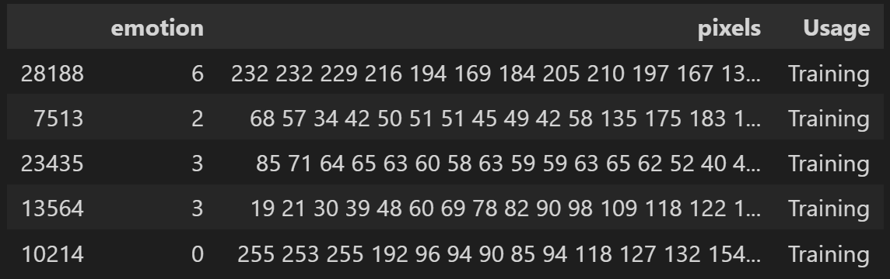

 Now, let\'s check the number of emotion categories we have the number of images associated with each:

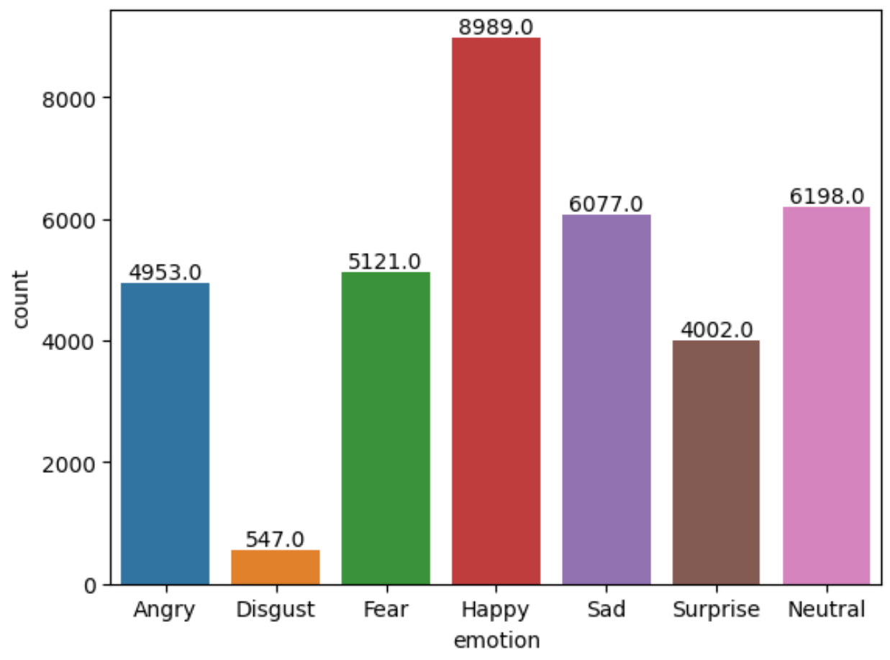
  
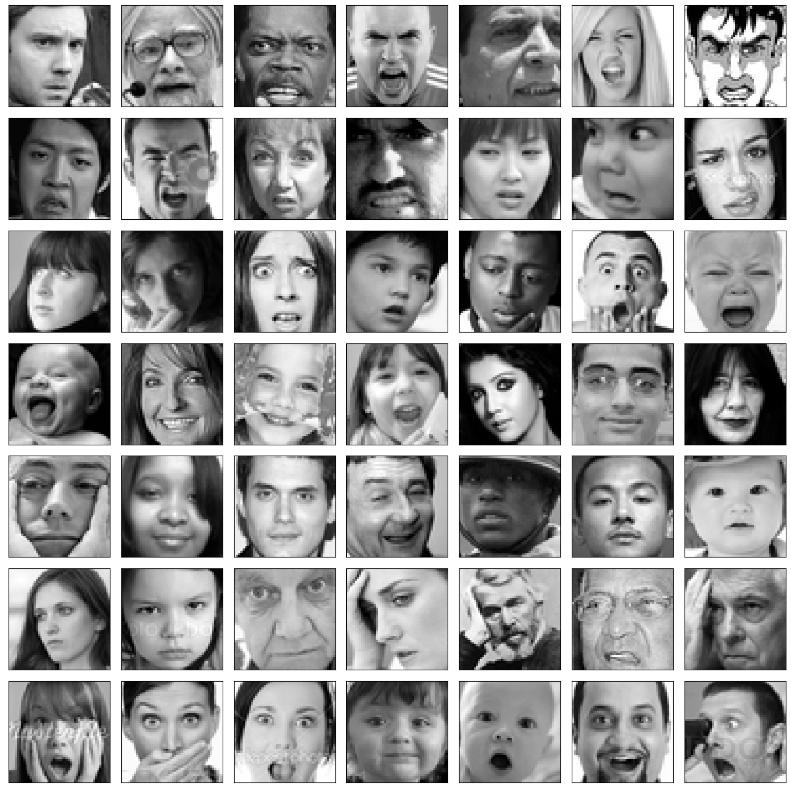

<h4 style="color:#FFDAB9; font-family: serif; font-size:1.2rem">Fer2013 data summary:</h4>

There are 7 categories of emotions in this data-set and emotion disgust has the minimum images around 5&ndash;10% of other classes.

<ol type='1'><li>The data contains a wide range of images like, male, female, kids, olds, white, black etc.</li><li>It contains some non-human images, like cartoons(first row, last column)</li><li>The dataset contain images collected with different lighting and angles.</li></ol>

 I have decided to train my model using the most 'distinguishable' emotions on the dataset 0:Anger, 3:Happy, 4:Sad and 6:Neutral. They are also the emotions with the higher number of images.

 
<h2 style='color:#90EE90; font-family: serif;'>Creating the Model</h2>

<h3 style="color:#FFDAB9; font-family: serif; font-size:1.2rem">Why the CNN model?</h3>

I choose CNN because, although it might require a bit more fine tuning than other models it is a more general purpose model that is less computationally expensive and it doesn't requires extensive amount data to the trained (e.g. OpenFace, FaceNet).

 
<h3 style="color:#FFDAB9; font-family: serif; font-size:1.2rem">Steps:</h3>
<ol type='1'><li>Ensure the data is compatible with the model needs: h:48 x w:48 x color:1 (greyscale) .</li><li>Label encode categories so they are compatible with the model.</li><li> Normalize the image arrays, because neural networks are highly sensitive to non-normalize data.</li><li>Stack the images so we can use mini-batch gradient descent as optimizer (system of small batches and feedback loops. It's less computationally efficient than SGD but more stable.)</li><li>Split the data into training and validation/test set.</li></ol>

<h3 style="color:#FFDAB9; font-family: serif; font-size:1.2rem">Model Settings:</h3>

<ol><li>Shuffling and Stratification: split the data into random order and make sure that all classes are being represented in the split.</li><li>Model Operation Layers:<ol><li>Conv2D: applies performance filter (250) to extract features that are spacially related</li><li>BatchNormalization: normalizes the inputs of the previous layer to speed training and improve performance</li><li>Dense: connected the neurons of the previous layers with the ones of the current layer</li><li>Dropout: randomly drops out some neurons during training to prevent overfitting</li></ol></li><li>Activation Function: ELU. applied to the output. allows for negative values to pass through the neural networks without being ignored (better performance). Avoids Relu problems where neurons can become dead and decrease in accuracy.</li><li>Callbacks: list of functions that will be called during the training to improve performance.<ol><li>EarlyStopping: avoids over-fitting</li><li>ReduceLROnPlateau: reduce learning rate when the validation accuracy plateaus.</li><li>ImageDataGenerator: applies changes to the image (e.g. rotations)</li></ol><li>Batch Size: 32</li><li>Epochs: 30</li><li>Optimizer: Adam. Commonly used for training images and speech rec.</li></li></ol>

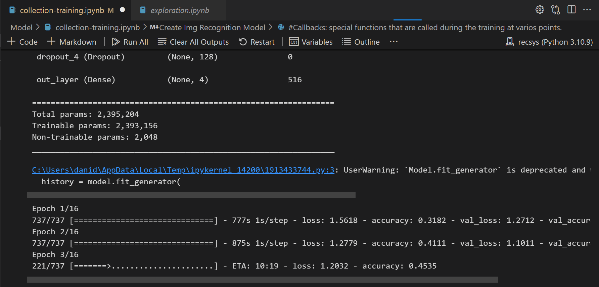

 Plotting training and validation metrics
  

<h3 style='font-size:1.2rem; color:#FFFFFF;'>Accuracy and Loss over time:</h3>

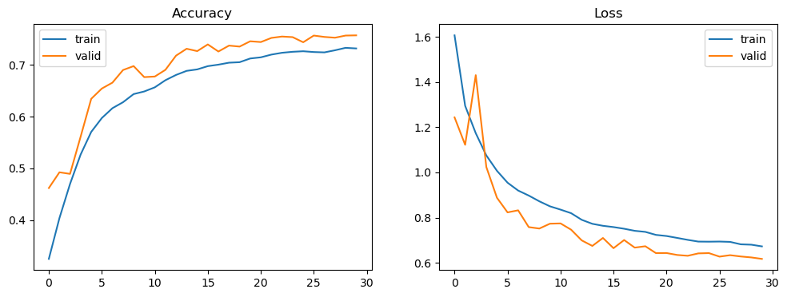
 
 
<h3 style="color:#FFDAB9; font-family: serif; font-size:1.2rem">Accuracy and loss over time summary</h3>
The epoch's history shows that the accuracy gradually increases, reaching +73% on training and +75% on validation data. We also see a gradual decrease in loss, with a sudden spike around epoch 5. This could be a signed of overfitting or unstable learning, but we can see that the validation data goes back to normal later, likely regularized by the Dropout layer or the ReduceLROnPlateau optmizer.
 
 
<h3 style='font-size:1.2rem; color:#FFFFFF;'>Accuracy and Loss distribution:</h3>

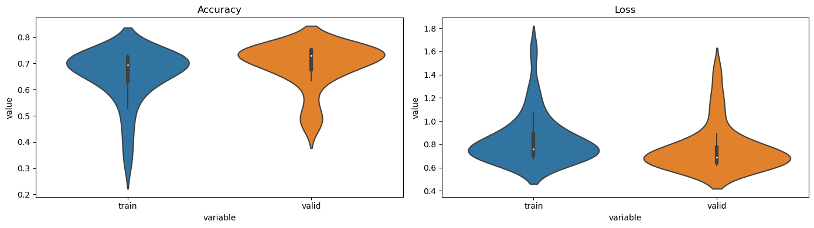
 
 
<h3 style="color:#FFDAB9; font-family: serif; font-size:1.2rem">Accuracy and loss distribution summary</h3>
The violin graph provides an extra layer of information about our dataset, telling us about the distribution (spread) of the accuracy and loss rates across the data.    In our dataset, we observed that 50% of the data falls between +60% and 70% accuracy for the training set, and 65%-75% accuracy for the validation and test sets. The loss rate is a bit high, at around 0.6. We need to determine if these values are enough for the problem we are trying to solve by looking at the performance metrics and other models benchmarks.
 
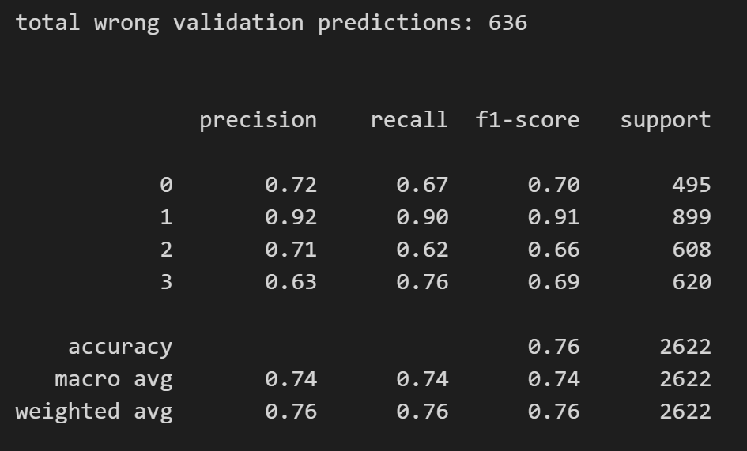
 
 
<h3 style="color:#FFDAB9; font-family: serif; font-size:1.2rem">Performance metrics summary</h3>
The precision, recall and f1-scores suggests that the model's performance is generally good across all classes. However, it also highlights the differences in performance within each class. For example, class 1 (happiness), has the highest precision and recall scores, indicating that the model is able to accurately predict this class more often than any other. At the same time, class 2 (sadness) has a the lowest precision score, indicating that the model makes more false positive predictions for this class.   Although at first glance this number might indicate a slight imbalance in the dataset, I believe that the lower precision score in this is class results from the facial expression similarities between Sad and Neutral as we have already seen. In addition, the weighted avg. and the macro avg. are similar indicating that the dataset is fairly balanced.
 

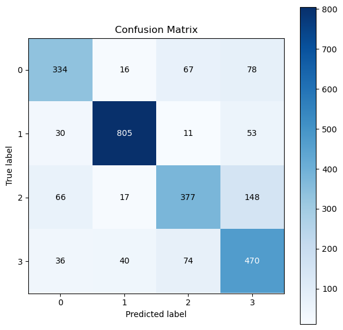

<h3 style="color:#FFDAB9; font-family: serif; font-size:1.2rem">Confusion matrix summary</h3> 
The confusion matrix table provides a more visual representation of the Model\'s performance by comparing the predictions with the true values of the dataset. It helps us identify where the model might need some improvements. There\'s definitely an opportunity to optimize the model by further balancing the data. That way the classes performance should be more evenly distributed. However, as we have seen, some images from the categories neutral and sad are hard to tell apart even for humans!   Finally, it is worth noting is that the model\'s predictions makes more mistakes differentiating the "Neutral" feeling to all other emotions. 
 
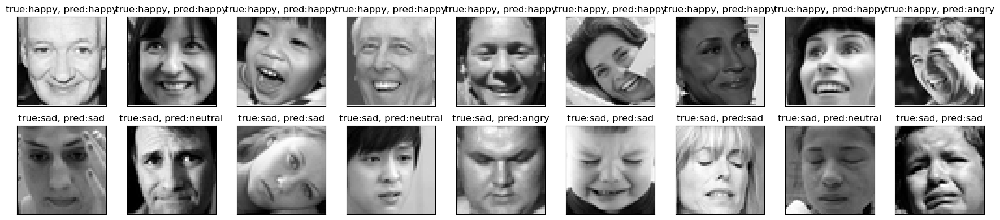

<h3 style="color:#FFDAB9; font-family: serif; font-size:1.2rem">Final Toughts</h3>
The performance of this initial model will be sufficient to help us make inferences about the user\'s emotions via the up, but further optimizations are needed to fine-tuned it to a more optimal level.     Overall, from this analysis we can conclude that it is hard for both humans and computers to read a resting b**** face. :)

 
 

<h2 style='color:#9FE1B4; font-family: serif;'>Spotify Data</h2>
<h3 style='color:#9FE1B4;'>Emotion labeled dataset from Spotify Api</h3>

The Spotify API provides developers with access to a massive library of songs and metadata. I utilized this API to extract songs from playlists that corresponded to the four emotion categories that I selected when creating the CNN model: angry, happy, sad, and neutral.

<h3 style="color:#FFDAB9; font-family: serif; font-size:1.2rem">Spotify Token</h3>

<ol type='1'><li>Get auth for App development (CLIENT_ID, CLIENT_SECRET) </li><li>Get auth for token for the queries.</li></ol>
"

Steps:

<ol>
  <li>Find mood playlists for each of the Model sentiments used</li>
  <li>Extract playlist id</li>
  <li>Create function to extract playlist data from Api based on the structure of the response dictionary.</li>
  <li>Create emotion column for each dictionary</li>
  <li>Append information to list</li>
  <li>Create df</li>
  <li>Save csv file</li>
</ol>

I used a total of 15 playlists, from the app's mood feature. This feature allows users to browser playlists and songs that are curated based  on different emotions. The resulting df looks like this:

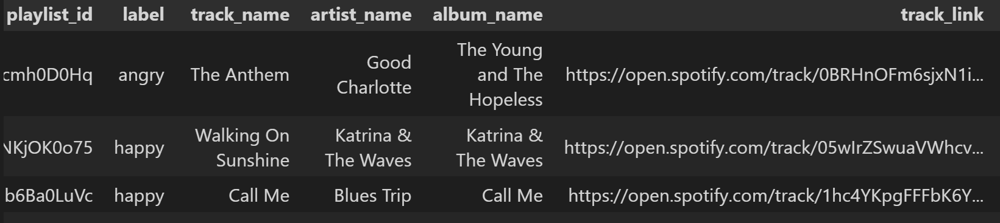

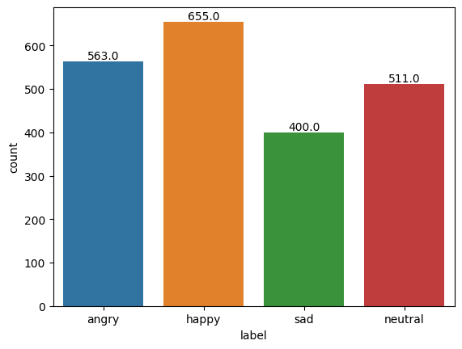

